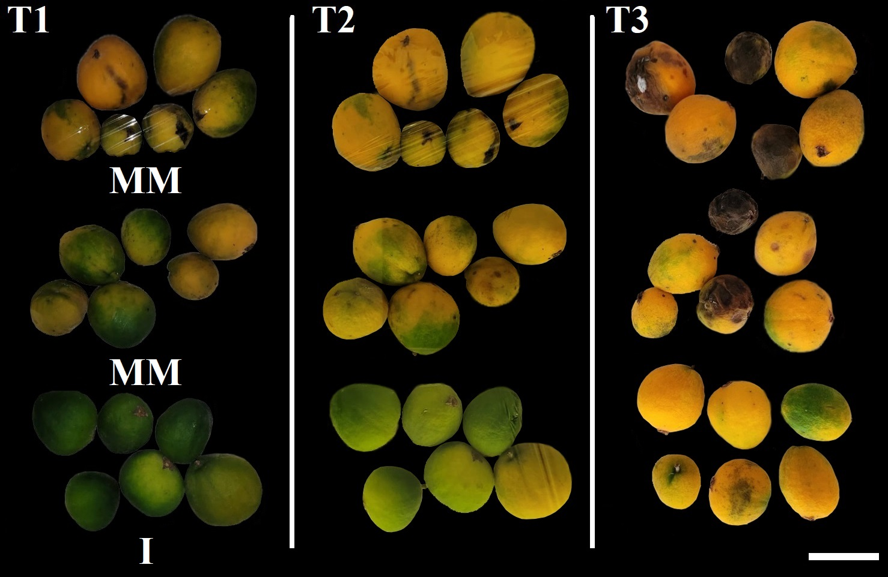

```{r, include=FALSE, error=TRUE}
knitr::opts_chunk$set(error = TRUE)
```


Evolución de frutos cosechados en estado inmaduro y medio maduro
```{r pressure, echo=FALSE, error=TRUE, fig.cap="Frutos de H. edulis cosechados en Gualeguaychú en noviembre de 2022", out.width = '100%'}



```

